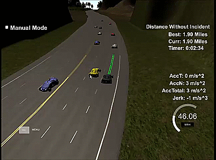

[video1]: results/SuccessfulTrialRun.mp4 "Successful trial run"

# Path Planning Project
This repo contains the code and markup for the Path Planning project. The goal of this project is develop algorithms to navigate through a virtual highway simulator with other NPC cars moving around. It is assumed that the sensor fusion is already done and we know perfectly where all other cars (and our own) are at any given moment. It is also required to maintain a smooth drive, i.e., no sudden acceleration/jerks that would cause discomfort for the passengers. Obviously all legal reqiurements (speeding limit, driving in lane, etc.) should also be met.

## Path planner
In order to implement the algorithms required for this project, I followed the walkthrough provided in the course. I did not develop a distintictive finite state machine, but made some general logic in order to fulfill the requirements. Developing a FSM with a Keep lane state, Prepare for Lane Change, and Lane Change (left and right) would be the next step to improve the algorithm logic.

### Algorithm basics
#### Generating waypoints
The (50) waypoints are generated from line 418-522 in the main.cpp file. Tests were done with more/less waypoints. When using more waypoints, the algorithm was too slow to react to changes (cars swerving ahead for example). Less waypoints were ok but had some issues when the car had to break due to really slow car infront of it (and no way to maneuver around). 

The basic is as follows:
1. Find previous waypoints to start from (this is done to ensure smooth tranistion for each update), an intial value is assumed for the times when the previous waypoint list is emtpy. Lines 421-433 main.cpp
2. Three waypoints that are evenly spaced (every 30m) are generated in Frenet coordinates. Tests were done with shorter and longer distances and more waypoints. With shorter distances, the spline function (that is used later) sometime tries too hard to fit and kind of wobbles. More waypoints generally increased computational complexity so they were avoided. Lines 442-446 main.cpp.
3. The car is shift/rotated so that we are always at 0,0 and moving at 0 degrees, done for simpler math. Lines 460-468 main.cpp
4. A spline is created and the other waypoints are fit inside this spline. Lines 472-518. Some comments are available in the code for this part.

It should be noted here that in line 262-265 of main.cpp, I assume that the car is located at the end of the waypoints calculated from the previous steps. This has the unintended consequence that if a car is moving inside the waypoint (sweving into my cars path), I might not be able to avoid it. This should be thought out more carefully.

#### Finding cars in the lanes
In order to avoid crashing into other cars and to maneuver around them, we need to keep track of other cars. This is done in lines 273-349 in main.cpp. In order to find the cars in the lanes, two lists are created (cars_left_lane and cars_right_lane) to track the cars in the adjacent lanes. After checking to see which lane the car is, if it is in our lane, we calculate our distance to it and if we are too close (less than 25 meters) we activate the too_close tag. If we are less than 10 m away we activate the way_too_close tag to break with maximum allowed braking. If the car is in the adjacent lanes, we add them to the appropriate list. We only add cars that would be in the way of our potential maneuver (cars that are within 35 meters of where are last waypoint is). This is a simplistic way to avoid crashing and very conservative. It sometimes results in us not trying to actively overtake a car even though a human driver might, and only does it when it is sure that it can do it safely. Improvements can be done here to include other algorithms to find better paths.

After these steps, if there are no flags activated, that means we are in the clear and we keep lane. Otherwise, if we are too close, we use a simple turn left first if possible algorithm. This is also very simple and we try to turn left if possible before even looking to turn right (lines 358-366 main.cpp). A better algorithm to weave in traffic could be the next line of work to improve this work. Lines 387-393 are in charge of changing lanes (which then go to the spline funciton for smooth transitions).

Finally, in cases where there is no where to go (cars in all lanes) we decrease the speed by 5 mps for the first 15 m, and if the car is still ahead of us we decrease it by close to 10 mps. Lines 371-403 in main.cpp are in charge of increasing/decreasing the speed based on the environment within the regulations.

## Discussion 
A video of a trial run (around 15 miles) is shown here [video][video1]. 

It can be seen that the car does a variety of maneuvers to go through the track at as close to 49.5 mps as possible. It fulfills the project rubric and is able to somewhat maneuver its way in the traffic. The driving is quite conservative and more implementation is needed to make it more human-like. 

Here is an example of a basic overtake. 


Sometimes it gets stuck behind traffic:


Here is an example of a double overtake (two cars):


And here is what happens when we get a slow car in front of us with no place to go (according to our algorithm the car can only change a lane immediately to the left or right if it is safe, it doesn't actively look for paths which would have been useful here)


Due to the algorithm which is not actively searching for a path and only looking at adjacent lanes, sometimes we run in to trouble, and it may take some time to get out of the traffic:


Finally sometimes the car crashes, though I am not convinced it is our fault....



In the tests I did with those scenarios, it was not possible to avoid cars suddenly swerving with the current algorithm and logic, without violating the jerk/acceleration rules. It would require further programing and including the heading/speed of the adjacent vehicles to remove (some of) the collisions, but the current submission fulfills the project rubrik (except for some unlucky scenarios like this).


---
## Implementation  
### Simulator.
Simlator can be found here [releases tab (https://github.com/udacity/self-driving-car-sim/releases).

### The map of the highway is in data/highway_map.txt
Each waypoint in the list contains  [x,y,s,dx,dy] values. x and y are the waypoint's map coordinate position, the s value is the distance along the road to get to that waypoint in meters, the dx and dy values define the unit normal vector pointing outward of the highway loop.

The highway's waypoints loop around so the frenet s value, distance along the road, goes from 0 to 6945.554.

## Basic Build Instructions

1. Clone this repo.
2. Make a build directory: `mkdir build && cd build`
3. Compile: `cmake .. && make`
4. Run it: `./path_planning`.

Here is the data provided from the Simulator to the C++ Program

#### Main car's localization Data (No Noise)

["x"] The car's x position in map coordinates

["y"] The car's y position in map coordinates

["s"] The car's s position in frenet coordinates

["d"] The car's d position in frenet coordinates

["yaw"] The car's yaw angle in the map

["speed"] The car's speed in MPH

#### Previous path data given to the Planner

//Note: Return the previous list but with processed points removed, can be a nice tool to show how far along
the path has processed since last time. 

["previous_path_x"] The previous list of x points previously given to the simulator

["previous_path_y"] The previous list of y points previously given to the simulator

#### Previous path's end s and d values 

["end_path_s"] The previous list's last point's frenet s value

["end_path_d"] The previous list's last point's frenet d value

#### Sensor Fusion Data, a list of all other car's attributes on the same side of the road. (No Noise)

["sensor_fusion"] A 2d vector of cars and then that car's [car's unique ID, car's x position in map coordinates, car's y position in map coordinates, car's x velocity in m/s, car's y velocity in m/s, car's s position in frenet coordinates, car's d position in frenet coordinates. 

## Details

1. The car uses a perfect controller and will visit every (x,y) point it recieves in the list every .02 seconds. The units for the (x,y) points are in meters and the spacing of the points determines the speed of the car. The vector going from a point to the next point in the list dictates the angle of the car. Acceleration both in the tangential and normal directions is measured along with the jerk, the rate of change of total Acceleration. The (x,y) point paths that the planner recieves should not have a total acceleration that goes over 10 m/s^2, also the jerk should not go over 50 m/s^3. (NOTE: As this is BETA, these requirements might change. Also currently jerk is over a .02 second interval, it would probably be better to average total acceleration over 1 second and measure jerk from that.

2. There will be some latency between the simulator running and the path planner returning a path, with optimized code usually its not very long maybe just 1-3 time steps. During this delay the simulator will continue using points that it was last given, because of this its a good idea to store the last points you have used so you can have a smooth transition. previous_path_x, and previous_path_y can be helpful for this transition since they show the last points given to the simulator controller with the processed points already removed. You would either return a path that extends this previous path or make sure to create a new path that has a smooth transition with this last path.

---

## Dependencies

* cmake >= 3.5
 * All OSes: [click here for installation instructions](https://cmake.org/install/)
* make >= 4.1
  * Linux: make is installed by default on most Linux distros
  * Mac: [install Xcode command line tools to get make](https://developer.apple.com/xcode/features/)
  * Windows: [Click here for installation instructions](http://gnuwin32.sourceforge.net/packages/make.htm)
* gcc/g++ >= 5.4
  * Linux: gcc / g++ is installed by default on most Linux distros
  * Mac: same deal as make - [install Xcode command line tools]((https://developer.apple.com/xcode/features/)
  * Windows: recommend using [MinGW](http://www.mingw.org/)
* [uWebSockets](https://github.com/uWebSockets/uWebSockets)
  * Run either `install-mac.sh` or `install-ubuntu.sh`.
  * If you install from source, checkout to commit `e94b6e1`, i.e.
    ```
    git clone https://github.com/uWebSockets/uWebSockets 
    cd uWebSockets
    git checkout e94b6e1
    ```
